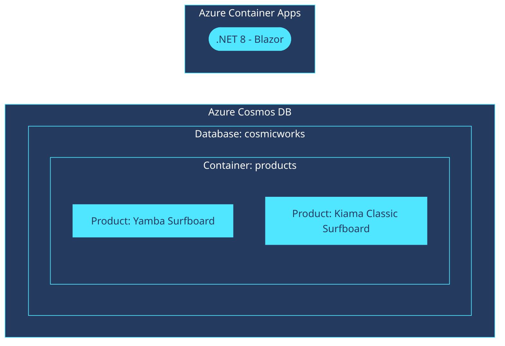

# Quickstart: Azure Cosmos DB for NoSQL client library for .NET

This is a simple Blazor web application to illustrate common basic usage of Azure Cosmos DB for NoSQL's client library for .NET. This sample application accesses an existing account, database, and container using the [`Microsoft.Azure.Cosmos`](https://www.nuget.org/packages/Microsoft.Azure.Cosmos) and  [`Azure.Identity`](https://www.nuget.org/packages/Azure.Identity) libraries from NuGet. Modify the source code and leverage the Infrastructure as Code (IaC) Bicep assets to get up and running quickly.

When you are finished, you will have a fully functional web application deployed to Azure.


<sup>Screenshot of the deployed web application.</sup>

### Prerequisites

> This template will create infrastructure and deploy code to Azure. If you don't have an Azure Subscription, you can sign up for a [free account here](https://azure.microsoft.com/free/). Make sure you have the contributor role in the Azure subscription.

The following prerequisites are required to use this application. Please ensure that you have them all installed locally.

- [Azure Developer CLI](https://aka.ms/azd-install)
- [.NET SDK 8.0](https://dotnet.microsoft.com/download/dotnet/8.0) 

### Quickstart

To learn how to get started with any template, follow the steps in [this quickstart](https://learn.microsoft.com/azure/cosmos-db/nosql/quickstart-dotnet) with this template (`cosmos-db-nosql-dotnet-quickstart`).

This quickstart will show you how to authenticate on Azure, initialize using a template, provision infrastructure and deploy code on Azure via the following commands:

```bash
# Log in to azd. Only required once per-install.
azd auth login

# First-time project setup. Initialize a project in the current directory, using this template.
# Omit the --template argument if you are running in a development container.
azd init --template cosmos-db-nosql-dotnet-quickstart

# Provision and deploy to Azure
azd up
```

### Application Architecture

This application utilizes the following Azure resources:

- [**Azure Container Registry**](https://learn.microsoft.com/azure/container-registry/)
    - This services hosts the container image.
- [**Azure Container Apps**](https://learn.microsoft.com/azure/container-apps/)
    - This service hosts the ASP.NET Blazor web application.
- [**Azure Cosmos DB for NoSQL**](https://learn.microsoft.com/azure/cosmos-db/) 
    - This service stores the NoSQL data.

Here's a high level architecture diagram that illustrates these components. Notice that these are all contained within a single **resource group**, that will be created for you when you create the resources.



### Cost of provisioning and deploying this template

This template provisions resources to an Azure subscription that you will select upon provisioning them. Refer to the [Pricing calculator for Microsoft Azure](https://azure.microsoft.com/pricing/calculator/) to estimate the cost you might incur when this template is running on Azure and, if needed, update the included Azure resource definitions found in [`infra/main.bicep`](infra/main.bicep) to suit your needs.

### Application Code

This template is structured to follow the [Azure Developer CLI](https://aka.ms/azure-dev/overview). You can learn more about `azd` architecture in [the official documentation](https://learn.microsoft.com/azure/developer/azure-developer-cli/make-azd-compatible?pivots=azd-create#understand-the-azd-architecture).

### Next Steps

At this point, you have a complete application deployed on Azure. But there is much more that the Azure Developer CLI can do. These next steps will introduce you to additional commands that will make creating applications on Azure much easier. Using the Azure Developer CLI, you can setup your pipelines, monitor your application, test and debug locally.

- [`azd pipeline config`](https://learn.microsoft.com/azure/developer/azure-developer-cli/configure-devops-pipeline?tabs=GitHub) - to configure a CI/CD pipeline (using GitHub Actions or Azure DevOps) to deploy your application whenever code is pushed to the main branch. 

- [Run and Debug Locally](https://learn.microsoft.com/azure/developer/azure-developer-cli/debug?pivots=ide-vs-code) - using Visual Studio Code and the Azure Developer CLI extension

- [`azd down`](https://learn.microsoft.com/azure/developer/azure-developer-cli/reference#azd-down) - to delete all the Azure resources created with this template 
