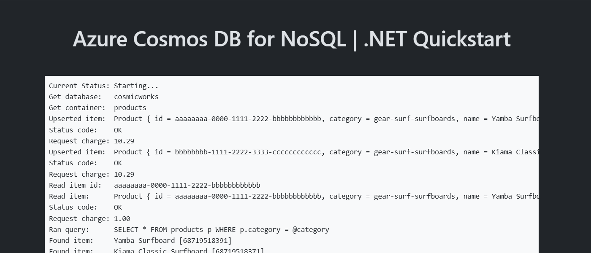

<!--
---
page_type: sample
name: "Quickstart: Azure Cosmos DB for NoSQL and Azure SDK for .NET"
description: This is a simple ASP.NET web application to illustrate common basic usage of Azure Cosmos DB for NoSQL and the Azure SDK for .NET.
urlFragment: template
languages:
- csharp
- azdeveloper
products:
- azure-cosmos-db
---
-->

# Quickstart: Azure Cosmos DB for NoSQL - Azure SDK for .NET

This is a simple Blazor web application to illustrate common basic usage of Azure Cosmos DB for NoSQL with the Azure SDK for .NET

## Prerequisites

- [Docker](https://www.docker.com/)
- [Azure Developer CLI](https://aka.ms/azd-install)
- [.NET SDK 9.0](https://dotnet.microsoft.com/download/dotnet/9.0) 

## Quickstart

1. Log in to Azure Developer CLI. *This is only required once per-install.*

    ```bash
    azd auth login
    ```

1. Initialize this template (`cosmos-db-nosql-dotnet-quickstart`) using `azd init`

    ```bash
    azd init --template cosmos-db-nosql-dotnet-quickstart
    ```

1. Ensure that **Docker** is running in your environment.

1. Use `azd up` to provision your Azure infrastructure and deploy the web application to Azure.

    ```bash
    azd up
    ```

1. Observed the deployed web application

    

1. (Optionally) Run this web application locally in the `src/web` folder: 

    ```dotnetcli
    dotnet watch run
    ```
